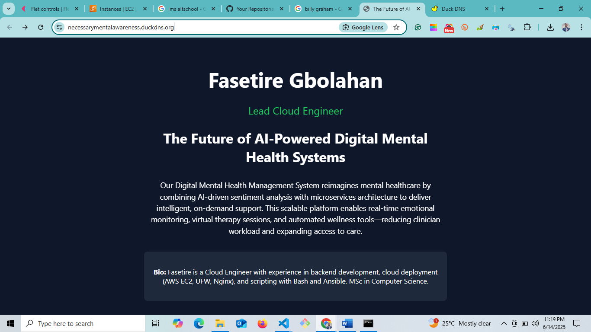

# 🚀 Dynamic Landing Page with Node.js, Nginx, and DuckDNS

This project showcases a fully deployed dynamic landing page powered by **Node.js**, reverse proxied with **Nginx**, and secured with **Let's Encrypt SSL** via a free **DuckDNS domain**. The entire setup is hosted on an **AWS EC2 Ubuntu instance**.

---

## 🌐 Features

- Dynamic landing page with HTML & CSS
- Node.js HTTP server (no frameworks)
- Nginx reverse proxy on port 80/443
- Free domain via DuckDNS (what I used, `necessarymentalawareness.duckdns.org`)
- HTTPS with Certbot and Let’s Encrypt
- Hosted on AWS EC2 (Ubuntu 22.04)

---
## 📁 Project Structure

```
nodeapp/
├── server.js       # Node.js server serving dynamic HTML
├── public/
│   └── style.css   # External stylesheet
```

---
## 🔧 Setup Instructions

### 1. 🔑 Provision EC2 Instance

- Ubuntu 22.04 LTS (Free tier)
- Open ports 22, 80, 443 in the **Security Group**

### 2. 📦 Install Dependencies

```bash
sudo apt update
sudo apt install nginx nodejs npm -y
```

---

### 3. 🛠️ Create Node.js App

```bash
mkdir ~/nodeapp && cd ~/nodeapp
nano server.js
```

I pasted Node.js code that serves HTML and links to `style.css`.

Create CSS:

```bash
mkdir public && nano public/style.css
```

---
### 4. 🔁 Configure Nginx Reverse Proxy

```bash
sudo nano /etc/ngnginx/sites-available/default
```

Set:

```nginx
server {
    listen 80;
    server_name necessarymentalawareness.duckdns.org;

    location / {
        proxy_pass http://localhost:3000;
        proxy_http_version 1.1;
        proxy_set_header Upgrade $http_upgrade;
        proxy_set_header Connection 'upgrade';
        proxy_set_header Host $host;
        proxy_cache_bypass $http_upgrade;
    }
}
```

To Reload Nginx:

```bash
sudo nginx -t && sudo systemctl reload nginx
```

---
### 5. 🌍 Register Free Domain with DuckDNS

- I visted [https://www.duckdns.org](https://www.duckdns.org)
- I Register/login with Google
- I Added this domain: `necessarymentalawareness`
- Setting up my EC2 IP
- My site: `https://necessarymentalawareness.duckdns.org`

---

### 6. 🔒 Add SSL with Certbot

```bash
sudo apt install certbot python3-certbot-nginx -y
sudo certbot --nginx -d necessarymentalawareness.duckdns.org
```

After this, HTTPS was enabled.

---

### 7. 🚀 Run the Node App

```bash
cd ~/nodeapp
nohup node server.js &
```

---

## ✅ Final Result with Screenshot of Page rendered

Visit: [https://necessarymentalawareness.duckdns.org/](https://necessarymentalawareness.duckdns.org/)  
My dynamic landing page should have been loaded securely!

---


## 👨‍💻 Author

**Fasetire Gbolahan**  
_Lead Cloud Engineer_

---

## 🛡️ License
This project is open-source and free to use under the MIT License.
This project is open-source and free to use under the MIT License.
